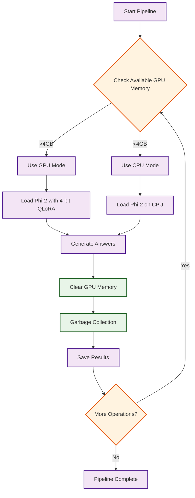
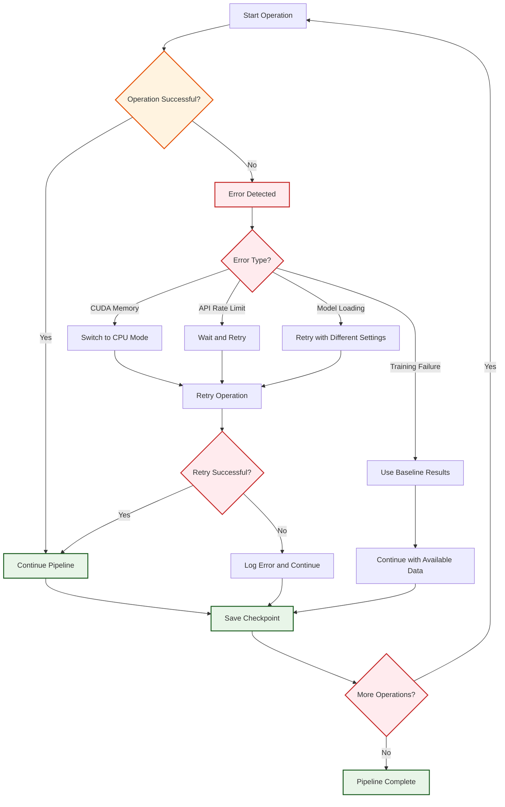
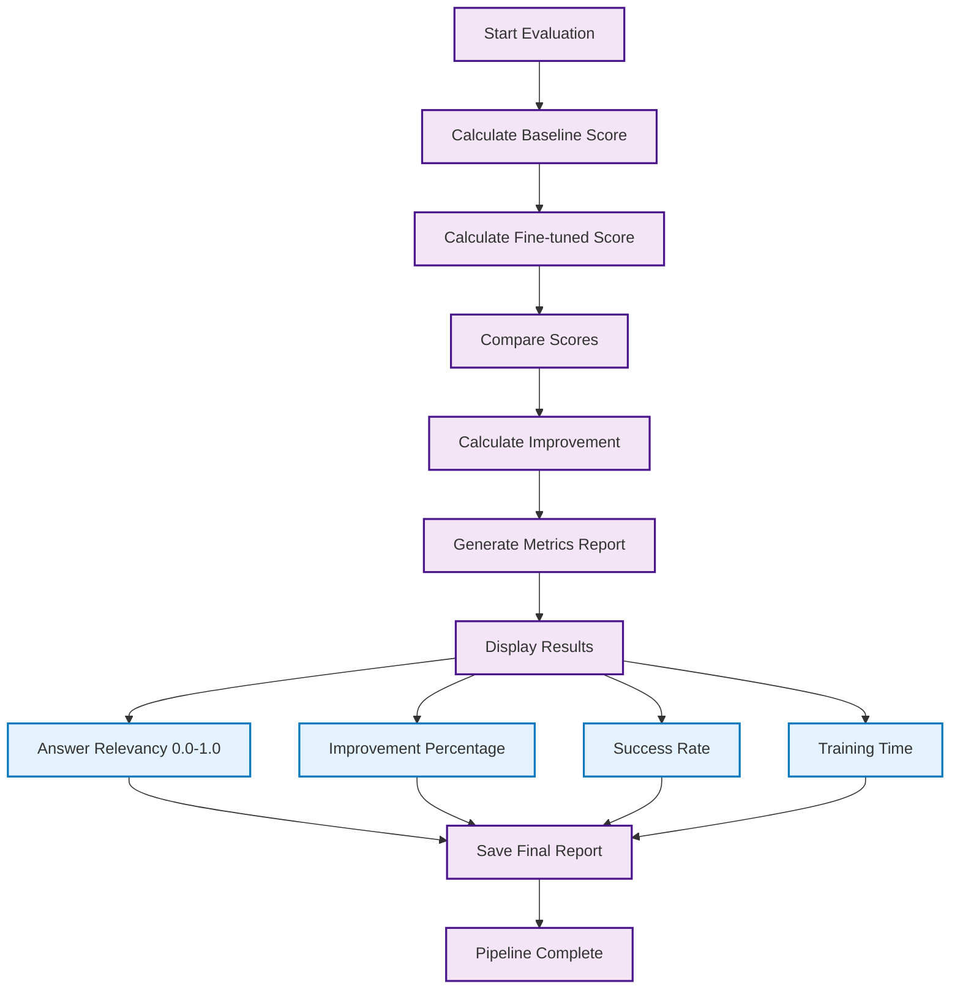
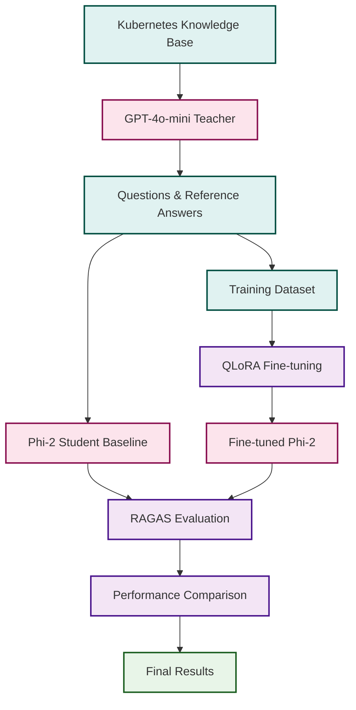

# Knowledge Distillation Pipeline - Corrected Mermaid Diagrams

## 1. Complete Pipeline Flow

```mermaid
flowchart TD
    A[User Clicks Start Pipeline] --> B[Load Configuration]
    B --> C[Load Kubernetes v1.28 Knowledge Base]
    C --> D[Generate Questions using GPT-4o-mini]
    D --> E[Save Questions Checkpoint]
    
    E --> F[Load Phi-2 Model 4-bit QLoRA]
    F --> G[Generate Baseline Answers with Untrained Phi-2]
    G --> H[Save Baseline Answers Checkpoint]
    
    H --> I[Generate Reference Answers using GPT-4o-mini]
    I --> J[Save Reference Answers Checkpoint]
    
    J --> K[Evaluate Baseline Answers using RAGAS]
    K --> L[Calculate Answer Relevancy Score]
    L --> M[Save Baseline Evaluation Checkpoint]
    
    M --> N{Fine-tuning Enabled?}
    N -->|Yes| O[Prepare Training Dataset]
    N -->|No| X[Skip to Fine-tuned Evaluation]
    
    O --> P[Configure QLoRA Parameters]
    P --> Q[Fine-tune Phi-2 with QLoRA]
    Q --> R[Save Fine-tuned Adapter]
    R --> S[Fine-tuning Complete]
    
    S --> T[Load Fine-tuned Phi-2 Model]
    T --> U[Generate Fine-tuned Answers]
    U --> V[Save Fine-tuned Answers]
    
    X --> W[Evaluate Fine-tuned Answers using RAGAS]
    V --> W
    W --> Y[Calculate Fine-tuned Relevancy Score]
    Y --> Z[Save Fine-tuned Evaluation Checkpoint]
    
    Z --> AA[Compare Baseline vs Fine-tuned Performance]
    AA --> BB[Calculate Improvement Metrics]
    BB --> CC[Save Complete Cycle Results]
    
    CC --> DD{More Cycles Remaining?}
    DD -->|Yes| EE[Start Next Cycle]
    DD -->|No| FF[Pipeline Complete]
    
    EE --> D
    
    FF --> GG[Display Final Results]
    GG --> HH[Show Performance Comparison]
    HH --> II[Display Improvement Statistics]
    II --> JJ[Show Sample Q&A Pairs]
    
    classDef startEnd fill:#e1f5fe,stroke:#01579b,stroke-width:2px
    classDef process fill:#f3e5f5,stroke:#4a148c,stroke-width:2px
    classDef decision fill:#fff3e0,stroke:#e65100,stroke-width:2px
    classDef save fill:#e8f5e8,stroke:#1b5e20,stroke-width:2px
    classDef model fill:#fce4ec,stroke:#880e4f,stroke-width:2px
    classDef evaluation fill:#e0f2f1,stroke:#004d40,stroke-width:2px
    
    class A,FF startEnd
    class B,C,D,G,I,K,L,O,P,Q,S,T,U,W,Y,AA,BB,EE process
    class N,DD decision
    class E,H,J,M,R,V,Z,CC save
    class F model
    class K,L,W,Y evaluation
```

## 2. Detailed Component Flow

```mermaid
flowchart TD
    subgraph "Question Generation Phase"
        A1[Select Kubernetes Topics] --> A2[Load Knowledge Base]
        A2 --> A3[Send to GPT-4o-mini API]
        A3 --> A4[Generate Domain-Specific Questions]
        A4 --> A5[Validate Question Quality]
    end
    
    subgraph "Baseline Generation Phase"
        B1[Load Phi-2 Model 4-bit] --> B2[Clear GPU Memory]
        B2 --> B3[Generate Answers with Untrained Model]
        B3 --> B4[Monitor Generation Time]
        B4 --> B5[Save Baseline Results]
    end
    
    subgraph "Reference Generation Phase"
        C1[Send Questions to GPT-4o-mini] --> C2[Generate Expert Answers]
        C2 --> C3[Quality Check]
        C3 --> C4[Save Reference Answers]
    end
    
    subgraph "Evaluation Phase"
        D1[Load RAGAS Framework] --> D2[Generate Embeddings]
        D2 --> D3[Calculate Cosine Similarity]
        D3 --> D4[Normalize Scores 0-1]
        D4 --> D5[Save Evaluation Results]
    end
    
    subgraph "Fine-tuning Phase"
        E1[Prepare Training Dataset] --> E2[Configure QLoRA]
        E2 --> E3[Start Fine-tuning Loop]
        E3 --> E4[Monitor Training Loss]
        E4 --> E5[Save Adapter Weights]
        E5 --> E6[Training Complete]
    end
    
    subgraph "Results Analysis Phase"
        F1[Load All Checkpoints] --> F2[Calculate Metrics]
        F2 --> F3[Generate Comparison Report]
        F3 --> F4[Display Final Results]
    end
    
    A5 --> B1
    B5 --> C1
    C4 --> D1
    D5 --> E1
    E6 --> F1
    
    classDef phase fill:#f0f8ff,stroke:#0066cc,stroke-width:2px
    class A1,A2,A3,A4,A5,B1,B2,B3,B4,B5,C1,C2,C3,C4,D1,D2,D3,D4,D5,E1,E2,E3,E4,E5,E6,F1,F2,F3,F4 phase
```

## 3. Memory Management Flow

## 4. Error Handling Flow

## 5. Performance Metrics Flow

## 6. Simple Pipeline Overview

## 7. Data Flow Diagram

## Usage Instructions

1. **Copy any diagram code** from above
2. **Paste into Mermaid Live Editor** (mermaid.live)
3. **The diagrams should work without syntax errors**
4. **Customize colors and styling** as needed

## Key Features

- **Removed emojis** that caused syntax issues
- **Simplified text** for better compatibility
- **Proper Mermaid syntax** for all diagrams
- **Color coding** for different operation types
- **Clear flow** from start to finish
- **Error handling** and decision points

These corrected diagrams should work perfectly in any Mermaid editor! 🎯 