# Improved Knowledge Distillation Pipeline Diagram

## Complete Pipeline Flow (2 Cycles, 3 Questions Each)

```mermaid
flowchart TD
    A[🚀 User Clicks Start Pipeline] --> B[📋 Load Configuration]
    B --> C[📚 Load Kubernetes v1.28 Knowledge Base]
    C --> D[🎯 Select Topics: Pods, Services, Storage]
    
    D --> E[🔄 CYCLE 1 START]
    E --> F[❓ Generate 3 Questions using GPT-4o-mini]
    F --> G[💾 Save Questions Checkpoint]
    
    G --> H[🤖 Load Phi-2 Model 4-bit QLoRA]
    H --> I[❓ Generate Baseline Answers for 3 Questions]
    I --> J[💾 Save Baseline Answers]
    
    J --> K[👨‍🏫 Generate Reference Answers using GPT-4o-mini]
    K --> L[💾 Save Reference Answers]
    
    L --> M[📊 Evaluate Baseline Answers using RAGAS]
    M --> N[📈 Calculate Baseline Relevancy Score]
    N --> O[💾 Save Baseline Evaluation]
    
    O --> P[⚙️ Prepare Training Dataset 3 Q&A Pairs]
    P --> Q[🧠 Fine-tune Phi-2 with QLoRA]
    Q --> R[💾 Save Fine-tuned Adapter]
    R --> S[✅ Fine-tuning Complete]
    
    S --> T[🤖 Load Fine-tuned Phi-2 Model]
    T --> U[❓ Generate Fine-tuned Answers for 3 Questions]
    U --> V[💾 Save Fine-tuned Answers]
    
    V --> W[📊 Evaluate Fine-tuned Answers using RAGAS]
    W --> X[📈 Calculate Fine-tuned Relevancy Score]
    X --> Y[💾 Save Fine-tuned Evaluation]
    
    Y --> Z[📊 Compare Baseline vs Fine-tuned Performance]
    Z --> AA[📈 Calculate Improvement Metrics]
    AA --> BB[💾 Save Cycle 1 Complete Results]
    
    BB --> CC[🔄 CYCLE 2 START]
    CC --> DD[❓ Generate 3 NEW Questions using GPT-4o-mini]
    DD --> EE[💾 Save Cycle 2 Questions]
    
    EE --> FF[🤖 Load Fine-tuned Phi-2 from Cycle 1]
    FF --> GG[❓ Generate Baseline Answers for 3 NEW Questions]
    GG --> HH[💾 Save Cycle 2 Baseline Answers]
    
    HH --> II[👨‍🏫 Generate Reference Answers for NEW Questions]
    II --> JJ[💾 Save Cycle 2 Reference Answers]
    
    JJ --> KK[📊 Evaluate Cycle 2 Baseline Answers]
    KK --> LL[📈 Calculate Cycle 2 Baseline Score]
    LL --> MM[💾 Save Cycle 2 Baseline Evaluation]
    
    MM --> NN[⚙️ Prepare Training Dataset 6 Q&A Pairs Total]
    NN --> OO[🧠 Fine-tune Phi-2 with QLoRA Round 2]
    OO --> PP[💾 Save Cycle 2 Fine-tuned Adapter]
    PP --> QQ[✅ Cycle 2 Fine-tuning Complete]
    
    QQ --> RR[🤖 Load Cycle 2 Fine-tuned Phi-2]
    RR --> SS[❓ Generate Cycle 2 Fine-tuned Answers]
    SS --> TT[💾 Save Cycle 2 Fine-tuned Answers]
    
    TT --> UU[📊 Evaluate Cycle 2 Fine-tuned Answers]
    UU --> VV[📈 Calculate Cycle 2 Fine-tuned Score]
    VV --> WW[💾 Save Cycle 2 Fine-tuned Evaluation]
    
    WW --> XX[📊 Compare All Cycles Performance]
    XX --> YY[📈 Calculate Overall Improvement]
    YY --> ZZ[💾 Save Complete Pipeline Results]
    
    ZZ --> AAA[🏁 PIPELINE COMPLETE]
    AAA --> BBB[📊 Display Final Results]
    BBB --> CCC[📈 Show Performance Comparison]
    CCC --> DDD[🎯 Display Improvement Statistics]
    DDD --> EEE[📋 Show Sample Q&A Pairs from Both Cycles]
    
    %% Styling
    classDef startEnd fill:#e1f5fe,stroke:#01579b,stroke-width:3px
    classDef cycle fill:#fff3e0,stroke:#e65100,stroke-width:2px
    classDef process fill:#f3e5f5,stroke:#4a148c,stroke-width:2px
    classDef decision fill:#fff3e0,stroke:#e65100,stroke-width:2px
    classDef save fill:#e8f5e8,stroke:#1b5e20,stroke-width:2px
    classDef model fill:#fce4ec,stroke:#880e4f,stroke-width:2px
    classDef evaluation fill:#e0f2f1,stroke:#004d40,stroke-width:2px
    classDef training fill:#f1f8e9,stroke:#33691e,stroke-width:2px
    
    class A,AAA startEnd
    class E,CC cycle
    class B,C,D,F,H,I,K,M,N,P,Q,S,T,U,W,X,Z,AA,DD,FF,GG,II,KK,LL,NN,OO,QQ,RR,SS,UU,VV,XX,YY,BBB,CCC,DDD,EEE process
    class G,J,L,O,R,V,Y,BB,EE,HH,JJ,LL,PP,TT,VV,ZZ save
    class H,FF model
    class M,N,W,X,KK,LL,UU,VV evaluation
    class Q,OO training
```

## Detailed Metrics Flow

```mermaid
flowchart TD
    A[📊 Start Pipeline Evaluation] --> B[📈 Cycle 1 Baseline Score]
    B --> C[📈 Cycle 1 Fine-tuned Score]
    
    C --> D[📊 Cycle 1 Improvement]
    D --> E[📈 Cycle 2 Baseline Score]
    E --> F[📈 Cycle 2 Fine-tuned Score]
    
    F --> G[📊 Cycle 2 Improvement]
    G --> H[📈 Overall Performance Analysis]
    
    H --> I[📋 Generate Comprehensive Report]
    I --> J[📊 Display Final Results]
    
    J --> K[📈 Answer Relevancy Scores]
    J --> L[📈 Improvement Percentages]
    J --> M[📈 Success Rates]
    J --> N[📈 Training Times]
    J --> O[📈 Model Convergence]
    
    K --> P[💾 Save Final Report]
    L --> P
    M --> P
    N --> P
    O --> P
    
    P --> Q[🎯 Pipeline Complete]
    
    %% Styling
    classDef metric fill:#e3f2fd,stroke:#0277bd,stroke-width:2px
    classDef process fill:#f3e5f5,stroke:#4a148c,stroke-width:2px
    classDef cycle fill:#fff3e0,stroke:#e65100,stroke-width:2px
    
    class K,L,M,N,O metric
    class A,B,C,D,E,F,G,H,I,J,P,Q process
    class B,C,D,E,F,G cycle
```

## Data Flow Between Cycles

## Memory Management Across Cycles

```mermaid
flowchart TD
    A[🔄 Start Pipeline] --> B{💾 Check GPU Memory}
    B -->|>4GB| C[🚀 Use GPU Mode]
    B -->|<4GB| D[💻 Use CPU Mode]
    
    C --> E[🤖 Load Phi-2 4-bit QLoRA]
    D --> F[🤖 Load Phi-2 on CPU]
    
    E --> G[🧠 Generate Cycle 1 Answers]
    F --> G
    
    G --> H[🧹 Clear GPU Memory]
    H --> I[💾 Save Cycle 1 Results]
    
    I --> J[🔄 Cycle 2: Load Fine-tuned Model]
    J --> K{💾 Check GPU Memory}
    K -->|>4GB| L[🚀 Use GPU Mode]
    K -->|<4GB| M[💻 Use CPU Mode]
    
    L --> N[🤖 Load Fine-tuned Phi-2]
    M --> N
    
    N --> O[🧠 Generate Cycle 2 Answers]
    O --> P[🧹 Clear GPU Memory]
    P --> Q[💾 Save Cycle 2 Results]
    
    Q --> R[📊 Final Evaluation]
    R --> S[✅ Pipeline Complete]
    
    classDef decision fill:#fff3e0,stroke:#e65100,stroke-width:2px
    classDef process fill:#f3e5f5,stroke:#4a148c,stroke-width:2px
    classDef memory fill:#e8f5e8,stroke:#1b5e20,stroke-width:2px
    classDef cycle fill:#fff3e0,stroke:#e65100,stroke-width:2px
    
    class B,K decision
    class A,C,D,E,F,G,J,L,M,N,O,R,S process
    class H,P memory
    class G,O cycle
```

## Key Features of This Improved Diagram:

1. **Shows 2 complete cycles** with 3 questions each
2. **Demonstrates model improvement** between cycles
3. **Includes memory management** across cycles
4. **Shows data accumulation** (6 total Q&A pairs by end)
5. **Displays comprehensive metrics** for both cycles
6. **Color-coded phases** for easy understanding
7. **Includes all checkpoints** and save points

This diagram provides a complete visual representation of how the knowledge distillation pipeline works across multiple cycles! 🎯 