# Knowledge Distillation Pipeline Flow Diagram

## Complete Pipeline Flow

```mermaid
flowchart TD
    A[🚀 User Clicks Start Pipeline] --> B[📋 Load Configuration]
    B --> C[📚 Load Kubernetes v1.28 Knowledge Base]
    C --> D[🎯 Generate Questions using GPT-4o-mini]
    D --> E[💾 Save Questions Checkpoint]
    
    E --> F[🤖 Load Phi-2 Model (4-bit QLoRA)]
    F --> G[❓ Generate Baseline Answers with Untrained Phi-2]
    G --> H[💾 Save Baseline Answers Checkpoint]
    
    H --> I[👨‍🏫 Generate Reference Answers using GPT-4o-mini]
    I --> J[💾 Save Reference Answers Checkpoint]
    
    J --> K[📊 Evaluate Baseline Answers using RAGAS]
    K --> L[📈 Calculate Answer Relevancy Score]
    L --> M[💾 Save Baseline Evaluation Checkpoint]
    
    M --> N{🔧 Fine-tuning Enabled?}
    N -->|Yes| O[⚙️ Prepare Training Dataset]
    N -->|No| X[📋 Skip to Fine-tuned Evaluation]
    
    O --> P[🎯 Configure QLoRA Parameters]
    P --> Q[🧠 Fine-tune Phi-2 with QLoRA]
    Q --> R[💾 Save Fine-tuned Adapter]
    R --> S[✅ Fine-tuning Complete]
    
    S --> T[🤖 Load Fine-tuned Phi-2 Model]
    T --> U[❓ Generate Fine-tuned Answers]
    U --> V[💾 Save Fine-tuned Answers]
    
    X --> W[📊 Evaluate Fine-tuned Answers using RAGAS]
    V --> W
    W --> Y[📈 Calculate Fine-tuned Relevancy Score]
    Y --> Z[💾 Save Fine-tuned Evaluation Checkpoint]
    
    Z --> AA[📊 Compare Baseline vs Fine-tuned Performance]
    AA --> BB[📈 Calculate Improvement Metrics]
    BB --> CC[💾 Save Complete Cycle Results]
    
    CC --> DD{🔄 More Cycles Remaining?}
    DD -->|Yes| EE[🔄 Start Next Cycle]
    DD -->|No| FF[🏁 Pipeline Complete]
    
    EE --> D
    
    FF --> GG[📊 Display Final Results]
    GG --> HH[📈 Show Performance Comparison]
    HH --> II[🎯 Display Improvement Statistics]
    II --> JJ[📋 Show Sample Q&A Pairs]
    
    %% Styling
    classDef startEnd fill:#e1f5fe,stroke:#01579b,stroke-width:2px
    classDef process fill:#f3e5f5,stroke:#4a148c,stroke-width:2px
    classDef decision fill:#fff3e0,stroke:#e65100,stroke-width:2px
    classDef save fill:#e8f5e8,stroke:#1b5e20,stroke-width:2px
    classDef model fill:#fce4ec,stroke:#880e4f,stroke-width:2px
    classDef evaluation fill:#e0f2f1,stroke:#004d40,stroke-width:2px
    
    class A,FF startEnd
    class B,C,D,G,I,K,L,O,P,Q,S,T,U,W,Y,AA,BB,EE process
    class N,DD decision
    class E,H,J,M,R,V,Z,CC save
    class F model
    class K,L,W,Y evaluation
```

## Detailed Component Flow

```mermaid
flowchart TD
    subgraph "Question Generation Phase"
        A1[🎯 Select Kubernetes Topics] --> A2[📚 Load Knowledge Base]
        A2 --> A3[🤖 Send to GPT-4o-mini API]
        A3 --> A4[❓ Generate Domain-Specific Questions]
        A4 --> A5[✅ Validate Question Quality]
    end
    
    subgraph "Baseline Generation Phase"
        B1[🤖 Load Phi-2 Model (4-bit)] --> B2[🧠 Clear GPU Memory]
        B2 --> B3[❓ Generate Answers with Untrained Model]
        B3 --> B4[⏱️ Monitor Generation Time]
        B4 --> B5[💾 Save Baseline Results]
    end
    
    subgraph "Reference Generation Phase"
        C1[👨‍🏫 Send Questions to GPT-4o-mini] --> C2[📝 Generate Expert Answers]
        C2 --> C3[🔍 Quality Check]
        C3 --> C4[💾 Save Reference Answers]
    end
    
    subgraph "Evaluation Phase"
        D1[📊 Load RAGAS Framework] --> D2[🔤 Generate Embeddings]
        D2 --> D3[📐 Calculate Cosine Similarity]
        D3 --> D4[📈 Normalize Scores (0-1)]
        D4 --> D5[💾 Save Evaluation Results]
    end
    
    subgraph "Fine-tuning Phase"
        E1[⚙️ Prepare Training Dataset] --> E2[🎯 Configure QLoRA]
        E2 --> E3[🧠 Start Fine-tuning Loop]
        E3 --> E4[📊 Monitor Training Loss]
        E4 --> E5[💾 Save Adapter Weights]
        E5 --> E6[✅ Training Complete]
    end
    
    subgraph "Results Analysis Phase"
        F1[📊 Load All Checkpoints] --> F2[📈 Calculate Metrics]
        F2 --> F3[📋 Generate Comparison Report]
        F3 --> F4[🎯 Display Final Results]
    end
    
    %% Connect phases
    A5 --> B1
    B5 --> C1
    C4 --> D1
    D5 --> E1
    E6 --> F1
    
    %% Styling
    classDef phase fill:#f0f8ff,stroke:#0066cc,stroke-width:2px
    class A1,A2,A3,A4,A5,B1,B2,B3,B4,B5,C1,C2,C3,C4,D1,D2,D3,D4,D5,E1,E2,E3,E4,E5,E6,F1,F2,F3,F4 phase
```

## Memory Management Flow

```mermaid
flowchart TD
    A[🔄 Start Pipeline] --> B{💾 Check Available GPU Memory}
    B -->|>4GB| C[🚀 Use GPU Mode]
    B -->|<4GB| D[💻 Use CPU Mode]
    
    C --> E[🤖 Load Phi-2 with 4-bit QLoRA]
    D --> F[🤖 Load Phi-2 on CPU]
    
    E --> G[🧠 Generate Answers]
    F --> G
    
    G --> H[🧹 Clear GPU Memory]
    H --> I[🗑️ Garbage Collection]
    I --> J[💾 Save Results]
    
    J --> K{🔄 More Operations?}
    K -->|Yes| B
    K -->|No| L[✅ Pipeline Complete]
    
    %% Styling
    classDef decision fill:#fff3e0,stroke:#e65100,stroke-width:2px
    classDef process fill:#f3e5f5,stroke:#4a148c,stroke-width:2px
    classDef memory fill:#e8f5e8,stroke:#1b5e20,stroke-width:2px
    
    class B,K decision
    class A,C,D,E,F,G,J,L process
    class H,I memory
```



## Error Handling Flow

```mermaid
flowchart TD
    A[🚀 Start Operation] --> B{❓ Operation Successful?}
    B -->|Yes| C[✅ Continue Pipeline]
    B -->|No| D[🚨 Error Detected]
    
    D --> E{🔍 Error Type?}
    E -->|CUDA Memory| F[💻 Switch to CPU Mode]
    E -->|API Rate Limit| G[⏱️ Wait and Retry]
    E -->|Model Loading| H[🔄 Retry with Different Settings]
    E -->|Training Failure| I[📋 Use Baseline Results]
    
    F --> J[🔄 Retry Operation]
    G --> J
    H --> J
    I --> K[📊 Continue with Available Data]
    
    J --> L{❓ Retry Successful?}
    L -->|Yes| C
    L -->|No| M[⚠️ Log Error and Continue]
    
    C --> N[💾 Save Checkpoint]
    K --> N
    M --> N
    
    N --> O{🔄 More Operations?}
    O -->|Yes| A
    O -->|No| P[🏁 Pipeline Complete]
    
    %% Styling
    classDef error fill:#ffebee,stroke:#c62828,stroke-width:2px
    classDef success fill:#e8f5e8,stroke:#1b5e20,stroke-width:2px
    classDef decision fill:#fff3e0,stroke:#e65100,stroke-width:2px
    
    class D,E,L,O error
    class C,N,P success
    class B decision
```



## Performance Metrics Flow

```mermaid
flowchart TD
    A[📊 Start Evaluation] --> B[📈 Calculate Baseline Score]
    B --> C[📈 Calculate Fine-tuned Score]
    
    C --> D[📊 Compare Scores]
    D --> E[📈 Calculate Improvement]
    
    E --> F[📋 Generate Metrics Report]
    F --> G[📊 Display Results]
    
    G --> H[📈 Answer Relevancy: 0.0-1.0]
    G --> I[📈 Improvement Percentage]
    G --> J[📈 Success Rate]
    G --> K[📈 Training Time]
    
    H --> L[💾 Save Final Report]
    I --> L
    J --> L
    K --> L
    
    L --> M[🎯 Pipeline Complete]
    
    %% Styling
    classDef metric fill:#e3f2fd,stroke:#0277bd,stroke-width:2px
    classDef process fill:#f3e5f5,stroke:#4a148c,stroke-width:2px
    
    class H,I,J,K metric
    class A,B,C,D,E,F,G,L,M process
```



## Usage Instructions

1. **Copy the Mermaid code** from any of the diagrams above
2. **Paste into a Mermaid editor** (like mermaid.live)
3. **Or use in documentation tools** that support Mermaid
4. **Customize colors and styling** as needed

## Key Features of the Diagrams

- **Complete flow** from user interaction to final results
- **Error handling** and fallback mechanisms
- **Memory management** strategies
- **Performance metrics** calculation
- **Checkpoint system** for data persistence
- **Visual styling** for different types of operations

These diagrams provide a comprehensive visual representation of how the knowledge distillation pipeline works from start to finish! 🎯 