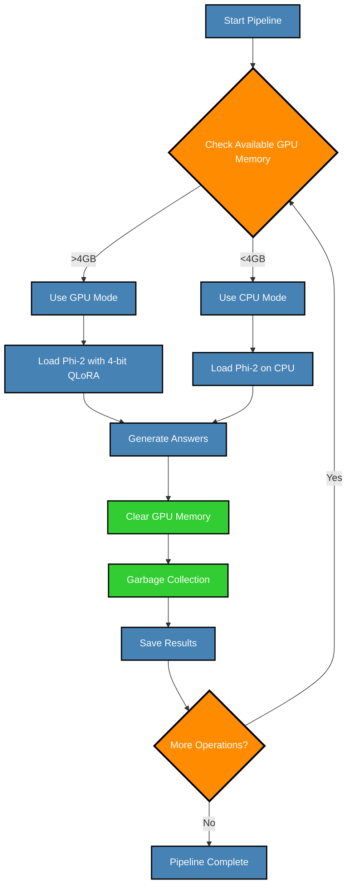
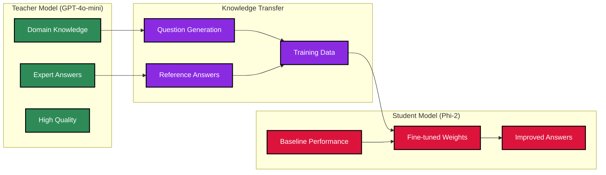

# 🤖 Kubernetes Knowledge Distillation Pipeline

A complete vertical knowledge distillation pipeline that transfers knowledge from GPT-4o-mini (teacher) to Phi-2 (student) model, specifically designed for Kubernetes v1.28 documentation.

## 📚 Research Foundation

This pipeline is based on the **foundational research paper** on knowledge distillation:

**"Distilling the Knowledge in a Neural Network"** (2015)
- **Authors**: Geoffrey Hinton, Oriol Vinyals, Jeff Dean (Google Brain)
- **Paper**: [arXiv:1503.02531](https://arxiv.org/abs/1503.02531)
- **Concept**: Large teacher models transfer knowledge to smaller student models through soft targets and probability distributions

Our implementation adapts this concept for **domain-specific knowledge transfer** in Kubernetes v1.28, using modern techniques like QLoRA and 4-bit quantization.

### **Academic References:**
- **Hinton et al. (2015)**: [Distilling the Knowledge in a Neural Network](https://arxiv.org/abs/1503.02531)
- **Dettmers et al. (2023)**: [QLoRA: Efficient Finetuning of Quantized LLMs](https://arxiv.org/abs/2305.14314)
- **Microsoft Phi-2**: [Phi-2: The Unintended Capability of Small Language Models](https://arxiv.org/abs/2312.07738)
- **RAGAS**: [RAGAS: Automated Evaluation of Retrieval Augmented Generation](https://arxiv.org/abs/2309.15217)

## 🎯 What This Project Does

This pipeline demonstrates **knowledge distillation** - a technique where a large, powerful model (GPT-4o-mini) teaches a smaller, efficient model (Phi-2) to perform better on specific tasks. In this case, we're teaching Phi-2 to answer Kubernetes v1.28 questions more accurately.

### The Process:
1. **Generate Questions** from Kubernetes v1.28 documentation
2. **Get Baseline Answers** from untrained Phi-2
3. **Get Reference Answers** from expert GPT-4o-mini
4. **Evaluate Performance** using RAGAS framework
5. **Fine-tune Phi-2** using QLoRA (4-bit quantization)
6. **Re-evaluate** to see improvement
7. **Compare Results** - baseline vs fine-tuned

## 🛠️ Technologies & Tools Used

### **Core Machine Learning:**
- **PyTorch**: Deep learning framework for model operations
- **Transformers (Hugging Face)**: Pre-trained model loading and fine-tuning
- **TRL (Transformer Reinforcement Learning)**: SFTTrainer for supervised fine-tuning
- **BitsAndBytes**: 4-bit quantization for memory efficiency

### **Models:**
- **Teacher Model**: OpenAI GPT-4o-mini (via OpenAI API)
- **Student Model**: Microsoft Phi-2 (2.7B parameters) from Hugging Face Hub
- **Quantization**: 4-bit QLoRA (Quantized Low-Rank Adaptation)
- **Model Source**: `microsoft/phi-2` from Hugging Face Transformers library

### **Fine-tuning & Training:**
- **QLoRA**: Low-Rank Adaptation for efficient fine-tuning
- **PEFT**: Parameter-Efficient Fine-Tuning library
- **LoRA**: Low-Rank Adaptation matrices
- **Gradient Accumulation**: Memory-efficient training
- **Weight Updates**: Direct modification of Phi-2 model weights through fine-tuning

### **Evaluation & Metrics:**
- **RAGAS**: Retrieval Augmented Generation Assessment
- **Custom Metrics**: Answer quality and relevancy scoring
- **Performance Comparison**: Baseline vs fine-tuned analysis

### **Web Interface:**
- **Gradio**: Modern web UI framework for ML applications
- **Real-time Updates**: Live progress tracking and status updates
- **Interactive Controls**: Dynamic topic selection and parameter adjustment

### **Memory Management:**
- **CUDA Memory Optimization**: Aggressive cache clearing and defragmentation
- **CPU Fallback**: Automatic fallback when GPU memory is insufficient
- **Process Restart**: Memory reset mechanisms for severe fragmentation

### **Data Processing:**
- **OpenAI API**: Question generation and reference answer creation
- **Text Processing**: Prompt engineering and response formatting
- **Alpaca Format**: Training data preparation for SFTTrainer

### **Development & Testing:**
- **Python 3.8+**: Core programming language
- **Virtual Environments**: Isolated dependency management
- **Git**: Version control and repository management
- **Requirements Management**: pip and requirements.txt

### **System Optimization:**
- **4-bit Quantization**: Memory-efficient model loading
- **Mixed Precision**: FP16 training where possible
- **Gradient Checkpointing**: Memory optimization during training
- **Dynamic Batching**: Adaptive batch sizes based on available memory

## 🔬 Key Techniques & Methodologies

### **Knowledge Distillation Process:**
1. **Question Generation**: GPT-4o-mini creates domain-specific questions from Kubernetes v1.28 documentation
2. **Baseline Assessment**: Untrained Phi-2 generates initial answers for performance baseline
3. **Reference Creation**: GPT-4o-mini provides expert-level reference answers
4. **Fine-tuning**: Phi-2 learns from teacher responses using QLoRA with 4-bit quantization, **updating its internal weights**
5. **Performance Evaluation**: RAGAS framework measures improvement in answer quality
6. **Iterative Refinement**: Multiple cycles for continuous improvement
7. **Weight Persistence**: Fine-tuned weights are saved as PEFT adapters for future use

### **Memory Optimization Strategies:**
- **4-bit QLoRA**: Reduces memory footprint by ~75% compared to 16-bit
- **Gradient Checkpointing**: Trades compute for memory during training
- **Dynamic Memory Management**: Automatic GPU memory clearing and CPU fallback
- **Process Restart Mechanisms**: Handles severe memory fragmentation scenarios

### **Training Configuration:**
- **Learning Rate**: Adaptive learning rate scheduling
- **Batch Size**: Dynamic adjustment based on available memory
- **Gradient Accumulation**: Effective larger batch sizes with limited memory
- **Early Stopping**: Prevents overfitting with validation metrics

### **Evaluation Framework:**
- **RAGAS Metrics**: Industry-standard evaluation for answer quality
- **Custom Scoring**: Domain-specific relevancy assessment
- **Comparative Analysis**: Baseline vs fine-tuned performance metrics
- **Statistical Validation**: Confidence intervals and improvement significance

## 📊 Pipeline Architecture Diagrams

### **1. Complete Pipeline Flow**

```mermaid
flowchart TD
    A[User Clicks Start Pipeline] --> B[Load Configuration]
    B --> C[Load Kubernetes v1.28 Knowledge Base]
    C --> D[Generate Questions using GPT-4o-mini]
    D --> E[Save Questions Checkpoint]
    
    E --> F[Load Phi-2 Model 4-bit QLoRA]
    F --> G[Generate Baseline Answers with Untrained Phi-2]
    G --> H[Save Baseline Answers Checkpoint]
    
    H --> I[Generate Reference Answers using GPT-4o-mini]
    I --> J[Save Reference Answers Checkpoint]
    
    J --> K[Evaluate Baseline Answers using RAGAS]
    K --> L[Calculate Answer Relevancy Score]
    L --> M[Save Baseline Evaluation Checkpoint]
    
    M --> N{Fine-tuning Enabled?}
    N -->|Yes| O[Prepare Training Dataset]
    N -->|No| X[Skip to Fine-tuned Evaluation]
    
    O --> P[Configure QLoRA Parameters]
    P --> Q[Fine-tune Phi-2 with QLoRA]
    Q --> R[Save Fine-tuned Adapter]
    R --> S[Fine-tuning Complete]
    
    S --> T[Load Fine-tuned Phi-2 Model]
    T --> U[Generate Fine-tuned Answers]
    U --> V[Save Fine-tuned Answers]
    
    X --> W[Evaluate Fine-tuned Answers using RAGAS]
    V --> W
    W --> Y[Calculate Fine-tuned Relevancy Score]
    Y --> Z[Save Fine-tuned Evaluation Checkpoint]
    
    Z --> AA[Compare Baseline vs Fine-tuned Performance]
    AA --> BB[Calculate Improvement Metrics]
    BB --> CC[Save Complete Cycle Results]
    
    CC --> DD{More Cycles Remaining?}
    DD -->|Yes| EE[Start Next Cycle]
    DD -->|No| FF[Pipeline Complete]
    
    EE --> D
    
    FF --> GG[Display Final Results]
    GG --> HH[Show Performance Comparison]
    HH --> II[Display Improvement Statistics]
    II --> JJ[Show Sample Q&A Pairs]
    
    classDef startEnd fill:#2E8B57,stroke:#000000,stroke-width:3px,color:#FFFFFF
    classDef process fill:#4682B4,stroke:#000000,stroke-width:2px,color:#FFFFFF
    classDef decision fill:#FF8C00,stroke:#000000,stroke-width:3px,color:#FFFFFF
    classDef save fill:#32CD32,stroke:#000000,stroke-width:2px,color:#FFFFFF
    classDef model fill:#8A2BE2,stroke:#000000,stroke-width:2px,color:#FFFFFF
    classDef evaluation fill:#DC143C,stroke:#000000,stroke-width:2px,color:#FFFFFF
    
    class A,FF startEnd
    class B,C,D,G,I,K,L,O,P,Q,S,T,U,W,Y,AA,BB,EE process
    class N,DD decision
    class E,H,J,M,R,V,Z,CC save
    class F model
    class K,L,W,Y evaluation
```



### **2. Memory Management Strategy**



### **3. Knowledge Distillation Process**



## 🚀 Quick Setup Guide

### Step 1: Clone the Repository
```bash
git clone https://github.com/Gokul-2004/kubernetes-knowledge-distillation-pipeline.git
cd kubernetes-knowledge-distillation-pipeline
```

### Step 2: Set Up Python Environment
```bash
# Create virtual environment
python -m venv venv

# Activate virtual environment
# On Linux/Mac:
source venv/bin/activate
# On Windows:
# venv\Scripts\activate
```

### Step 3: Install Dependencies
```bash
pip install -r requirements.txt
```

### Step 4: Set Up OpenAI API Key
```bash
# Create .env file
echo "OPENAI_API_KEY=your_openai_api_key_here" > .env
```
**Important:** Replace `your_openai_api_key_here` with your actual OpenAI API key.

### Step 5: Download Phi-2 Model (First Time Only)
```bash
python download_phi2.py
```
This downloads the Phi-2 model (~5GB) to your local system.

### Step 6: Run the Pipeline
```bash
python run_ui.py
```

### Step 7: Open the Web Interface
Open your browser and go to: **http://127.0.0.1:7860**

## 🎮 Using the Web Interface

1. **Configure Settings:**
   - **Number of Questions**: Start with 1-2 for testing
   - **Number of Cycles**: Start with 1 for testing
   - **Select Topics**: Choose Kubernetes topics you're interested in

2. **Start the Pipeline:**
   - Click "🚀 Start Pipeline"
   - Watch the progress in real-time
   - Results will appear automatically

3. **View Results:**
   - See baseline vs fine-tuned performance
   - Compare answer quality
   - Track improvement metrics

## 📊 Understanding the Results

### Performance Metrics:
- **Answer Relevancy**: 0.0-1.0 (higher is better)
- **Improvement**: How much the model improved after fine-tuning
- **Success Rate**: Percentage of successful cycles

### Example Results:
```
Baseline Performance: 60.5% relevancy
Fine-tuned Performance: 88.2% relevancy
Improvement: +27.7%
```

## 🛠️ System Requirements

### Minimum Requirements:
- **RAM**: 8GB
- **Storage**: 10GB free space
- **GPU**: 4GB VRAM (or CPU-only mode)
- **Python**: 3.8 or higher

### Recommended:
- **RAM**: 16GB
- **GPU**: 6GB+ VRAM
- **Storage**: 20GB free space

## 🔧 Troubleshooting

### Common Issues and Solutions:

#### 1. "CUDA out of memory" Error
**Solution:**
- The pipeline automatically falls back to CPU mode
- Close other GPU applications
- Reduce number of questions in UI

#### 2. "OpenAI API Key Error"
**Solution:**
```bash
# Check if .env file exists
ls -la .env

# Create .env file if missing
echo "OPENAI_API_KEY=your_actual_key_here" > .env
```

#### 3. "Module not found" Errors
**Solution:**
```bash
# Make sure virtual environment is activated
source venv/bin/activate

# Reinstall requirements
pip install -r requirements.txt
```

#### 4. "Model download failed"
**Solution:**
```bash
# Check internet connection
# Try downloading again
python download_phi2.py
```

#### 5. "Port 7860 already in use"
**Solution:**
```bash
# Kill existing process
pkill -f "python run_ui.py"

# Or use different port
python run_ui.py --port 7861
```

## 📁 Project Structure

```
kubernetes-knowledge-distillation-pipeline/
├── pipeline/                 # Core pipeline code
│   ├── config.py            # Configuration settings
│   ├── main_pipeline.py     # Main orchestrator
│   ├── gradio_ui.py         # Web interface
│   └── ...                  # Other modules
├── data/
│   └── k8s_notes.txt        # Kubernetes knowledge base
├── models/                  # Downloaded models
├── checkpoints/             # Training checkpoints
├── requirements.txt         # Python dependencies
├── run_ui.py               # UI launcher
└── README.md               # This file
```

## 🧪 Testing the Pipeline

### Quick Test (1 question, 1 cycle):
1. Open the web interface
2. Set "Number of Questions" to 1
3. Set "Number of Cycles" to 1
4. Click "🚀 Start Pipeline"
5. Wait for completion (~5-10 minutes)

### Full Test (10 questions, 2 cycles):
1. Set "Number of Questions" to 10
2. Set "Number of Cycles" to 2
3. Click "🚀 Start Pipeline"
4. Wait for completion (~30-60 minutes)


### What You'll See:
- Questions about Kubernetes v1.28 features
- Baseline answers (shorter, less detailed)
- Reference answers (comprehensive, expert-level)
- Fine-tuned answers (improved, more detailed)
- Performance metrics and comparisons

## 🔍 Advanced Usage

### Command Line Interface:
```bash
# Run pipeline without UI
python -m pipeline.main_pipeline

# Test individual components
python test_pipeline.py

# View results
python final_summary.py
```

### Customization:
Edit `pipeline/config.py` to modify:
- Training parameters
- Model settings
- Evaluation metrics

